# 配車管理API
## 概要
* スタッフ送迎時の配車・乗客管理に関するCRUD機能を持ったREST API。
* データベースには以下の情報を持つが、現状配車管理ページ以外のCRUD機能を実装することを目標とする。
    * 配車車両
    * 乗客
    * 車両
    * 配車ステータス
    * 乗客ステータス
    * 配車管理ページ(配車管理ページは後日実装予定)
## 作成背景
前職でイベント会場からホテルまでのスタッフ送迎を主にタクシーで行っていた際、本部にて手配した車両台数と待機中のスタッフ数が、タクシーを受ける担当者に対しトランシーバーでのみ伝えられ、タクシー受け担当者は次々追加される配車台数・到着台数・乗車人数・出発済台数の把握を自身の記憶でのみ行っていた。  
そのため連絡情報のミスが起き、現状把握が難しくなった果てに配車台数が足りなくなるなどスタッフを待たせることもあり、双方で共有でき視認して確認できるようなアプリケーションを作成しようと考えた。
## 主な使用技術
* Java
* Spring Boot
* MySQL
* Docker
* Swagger
* CI/CD
* AWS（使用予定）
## アプリケーション概略図
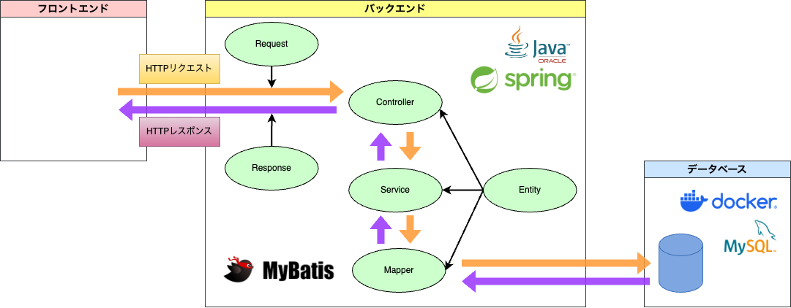  

### 機能
[API仕様書](https://pon02.github.io/Assignment-10/)参照
### 操作イメージ図
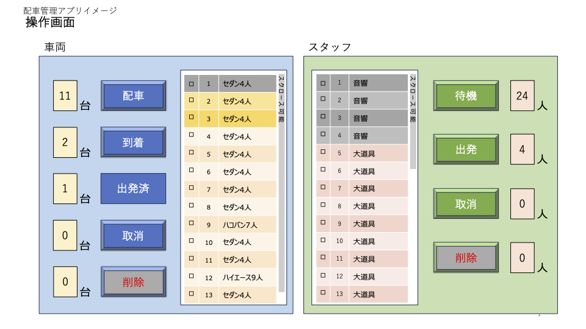
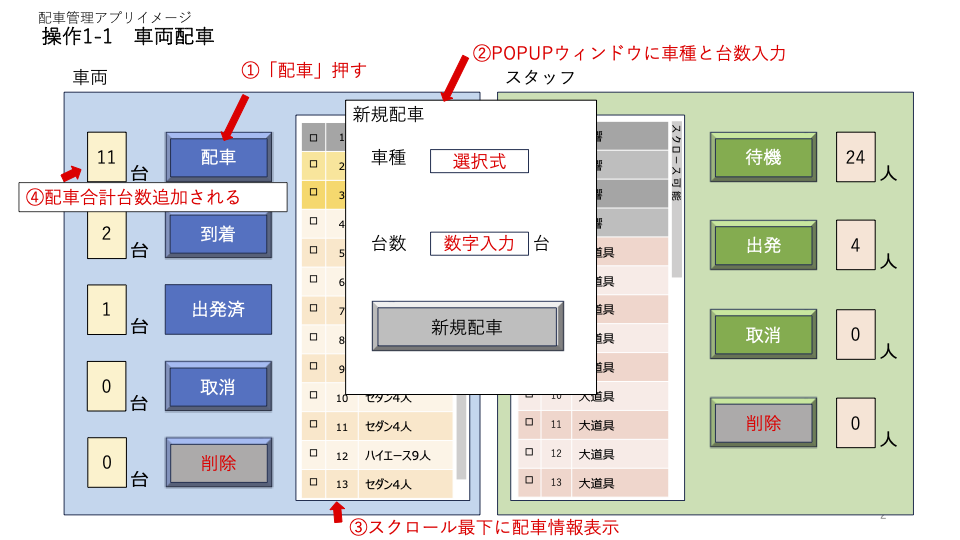
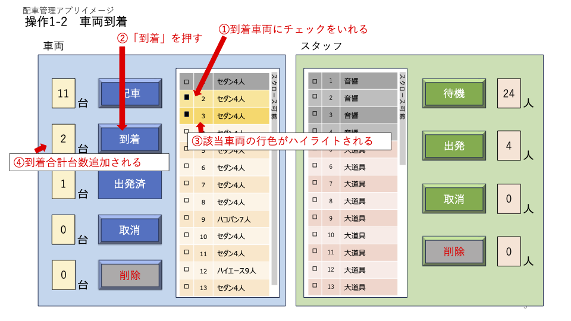
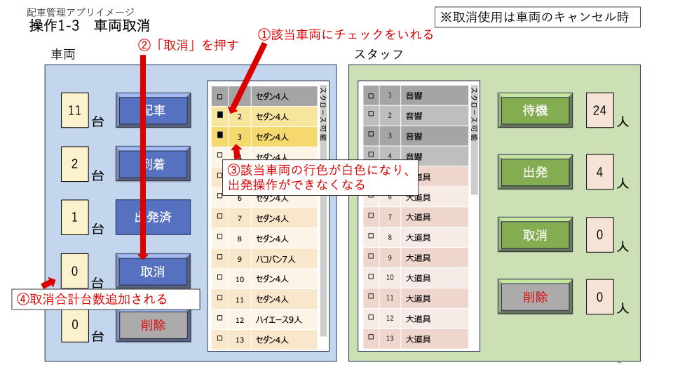
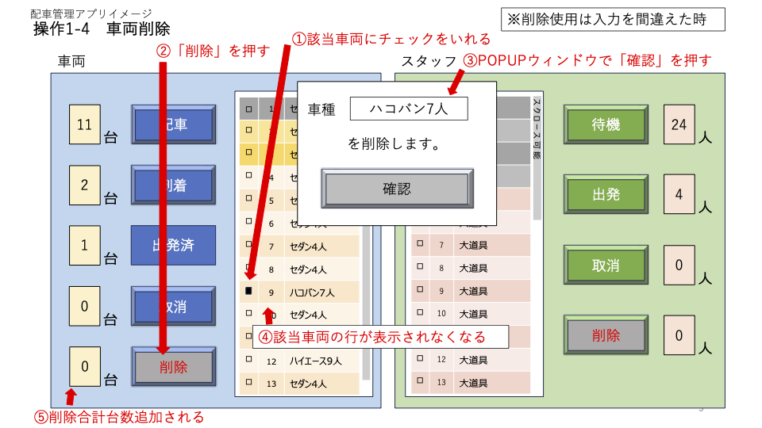
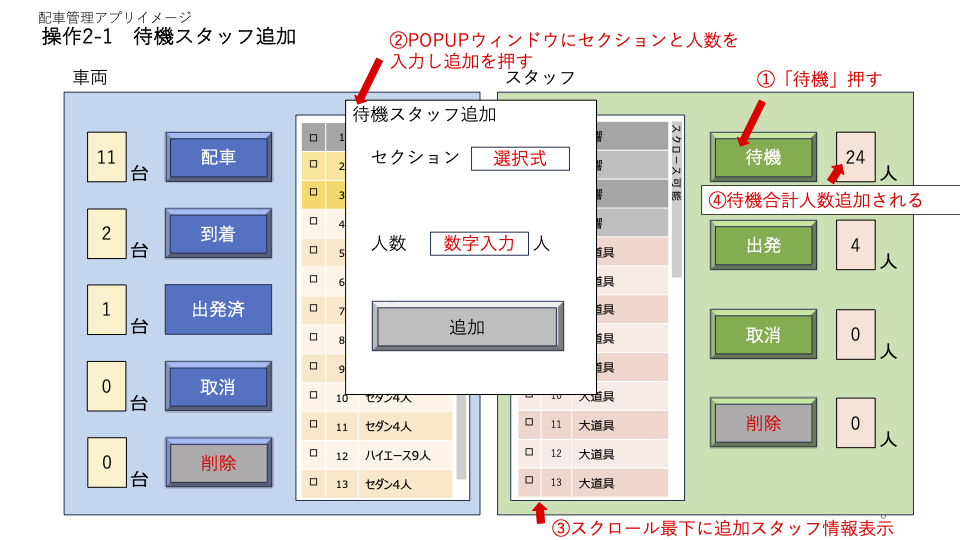
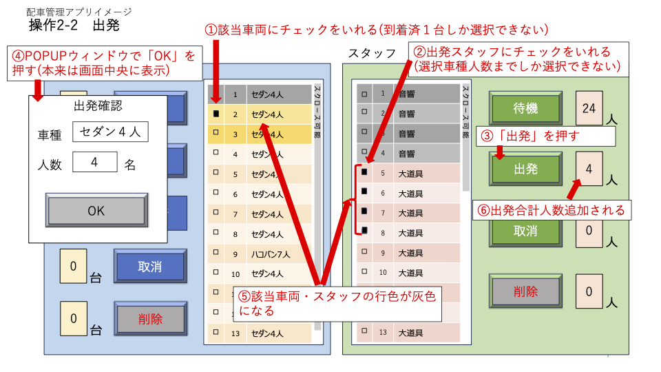
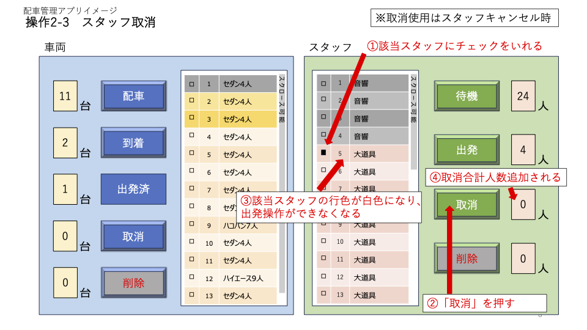
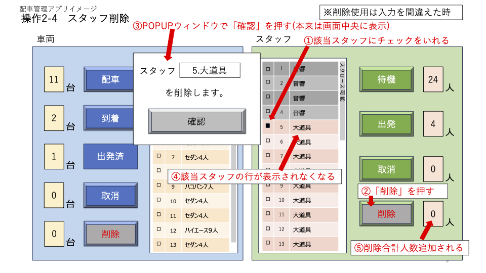

## 設計書
### ER図
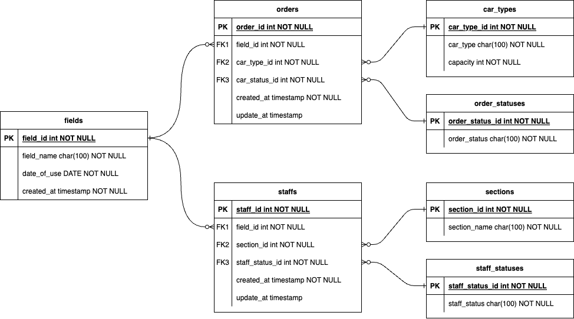  

### データベース定義
* ordersテーブル  

| カラム名(論理名) | カラム名(物理名)     | 型         | PK  | NN  | FK  | 備考             |  
|-----------|---------------|-----------|:---:|:---:|:---:|----------------|  
| ID        | order_id      | INT       |  ○  |  ○  |     | AUTO INCREMENT |  
| フィールドID   | field_id      | INT       |     |  ○  |  ○  |                |  
| 車種ID      | car_type_id   | INT       |     |  ○  |  ○  |                |  
| 車両ステータスID | car_status_id | INT       |     |  ○  |  ○  |                |  
| 作成日時      | created_at    | TIMESTAMP |     |  ○  |     |                |  
| 更新日時      | updated_at    | TIMESTAMP |     |     |     |                |  

* car_typesテーブル  

| カラム名(論理名) | カラム名(物理名)   | 型            | PK  | NN  | FK  | 備考             |  
|-----------|-------------|--------------|:---:|:---:|:---:|----------------|  
| ID        | car_type_id | INT          |  ○  |  ○  |     | AUTO INCREMENT |  
| 車種名       | car_type    | VARCHAR(100) |     |  ○  |     |                |  
| 定員        | capacity    | INT          |     |  ○  |     |                |  

* order_statusesテーブル  

| カラム名(論理名) | カラム名(物理名)       | 型            | PK  | NN  | FK  | 備考             |  
|-----------|-----------------|--------------|:---:|:---:|:---:|----------------|  
| ID        | order_status_id | INT          |  ○  |  ○  |     | AUTO INCREMENT |  
| ステータス名    | order_status    | VARCHAR(100) |     |  ○  |     |                |  

* staffsテーブル  

| カラム名(論理名)   | カラム名(物理名)       | 型         | PK  | NN  | FK  | 備考             |  
|-------------|-----------------|-----------|:---:|:---:|:---:|----------------|  
| ID          | staff_id        | INT       |  ○  |  ○  |     | AUTO INCREMENT |  
| フィールドID   | field_id      | INT       |     |  ○  |  ○  |                |  
| セクションID     | section_id      | INT       |     |  ○  |  ○  |                |  
| スタッフステータスID | staff_status_id | INT       |     |  ○  |  ○  |                |  
| 作成日時        | created_at      | TIMESTAMP |     |  ○  |     |                |  
| 更新日時        | updated_at      | TIMESTAMP |     |     |     |                |  

* sectionsテーブル  

| カラム名(論理名) | カラム名(物理名)    | 型            | PK  | NN  | FK  | 備考             |  
|-----------|--------------|--------------|:---:|:---:|:---:|----------------|  
| ID        | section_id   | INT          |  ○  |  ○  |     | AUTO INCREMENT |  
| セクション名    | section_name | VARCHAR(100) |     |  ○  |     |                |  

* staff_statusesテーブル  

| カラム名(論理名) | カラム名(物理名)       | 型            | PK  | NN  | FK  | 備考             |  
|-----------|-----------------|--------------|:---:|:---:|:---:|----------------|  
| ID        | staff_status_id | INT          |  ○  |  ○  |     | AUTO INCREMENT |  
| ステータス名    | staff_status    | VARCHAR(100) |     |  ○  |     |                |  

* fieldsテーブル

| カラム名(論理名) | カラム名(物理名)   | 型            | PK  | NN  | FK  | 備考             |
|-----------|-------------|--------------|:---:|:---:|:---:|----------------|
| ID        | field_id    | INT          |  ○  |  ○  |     | AUTO INCREMENT |
| フィールド名    | name        | VARCHAR(100) |     |  ○  |     |                |
| 使用日       | date_of_use | DATE         |     |  ○  |     |                |
| 作成日時      | created_at  | TIMESTAMP    |     |  ○  |     |                |

### API仕様
[API仕様書](https://pon02.github.io/Assignment-10/)参照
## ローカルでの実行方法
1. git,Java,MySQL,Dockerをインストール
2. リポジトリをクローン
    ```bash
    git clone
    ```
3. プロジェクトディレクトリに移動
4. Dockerコンテナを起動
    ```bash
    docker-compose up -d
    ```
5. Spring Bootアプリケーションを起動
    ```bash
    ./gradlew bootRun
    ```

## 今後の実装予定
* フロントエンドの実装  
最終的には概要記載の全てのCRUD機能とアカウント機能を実装し、複数人で情報共有できるようにしていきたい。